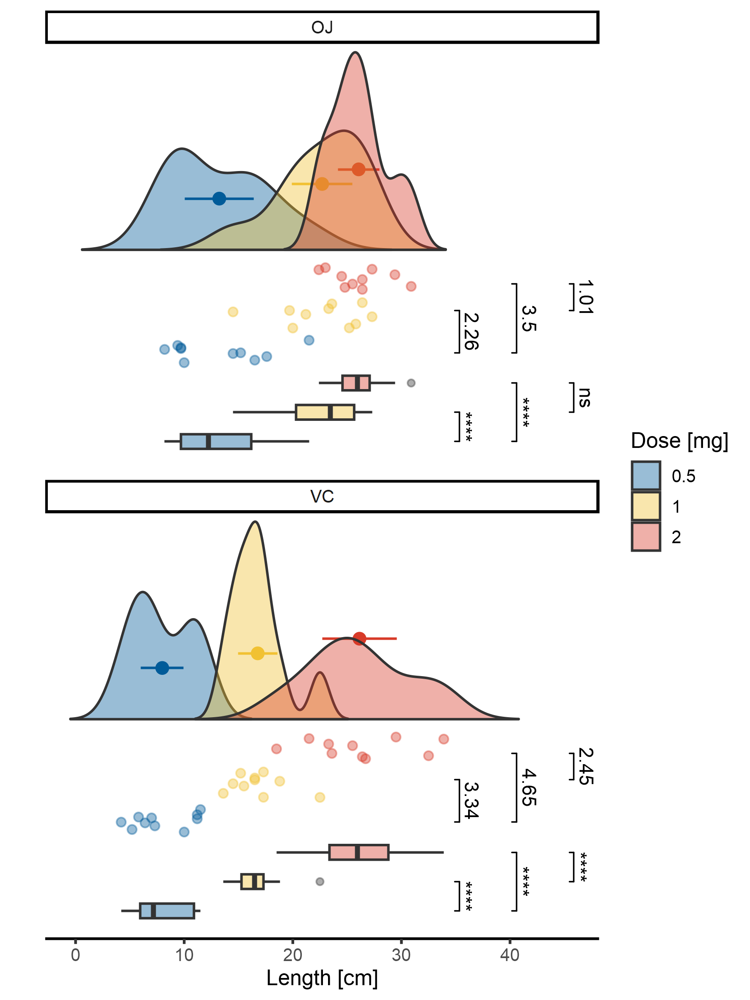

<!-- README.md is generated from README.Rmd. Please edit that file -->

# vecmatch

<!-- badges: start -->
<!-- badges: end -->

An implementation of Vector Matching algorithm. Enables the assesment of
initial covariate imbalances through ellegant graphics, estimates
treatment assignment probabilities using various methods, defines the
common support region, and performs matching across multiple groups.

## Installation

You can install the development version of `vecmatch` from
[GitHub](https://github.com/Polymerase3/vecmatch) with:

``` r
# install.packages("devtools")
devtools::install_github("Polymerase3/vecmatch")
```

## Example

At present, the only fully operational function in the package is
`raincloud()`, which creates elegant visualizations to assess the
imbalance of continuous covariates. To access the documentation for
`raincloud()`, type:

``` r
help(raincloud)
```

An example of how to use raincloud() is provided below. For detailed
descriptions of the individual arguments, please refer to the function’s
documentation:

``` r
## Example: Creating a raincloud plot for the ToothGrowth dataset.
## This plot visualizes the distribution of the `len` variable by
## `dose` (using different colors) and facets by `supp`. Group
## differences by `dose` are calculated using a `t_test`, and standardized
## mean differences (SMDs) are displayed through jittered points.

p <- raincloud(ToothGrowth, len, dose, supp,
               significance = 't_test',
               jitter = 0.15, alpha = 0.4)

## As `p` is a valid `ggplot` object, we can manipulate its characteristics using
## the `ggplot2` or `ggpubr` packages to create publication grade plot:
p <- p +
  theme_classic2() %+replace%
  theme(axis.line.y = element_blank(),
        axis.ticks.y = element_blank()) +
  guides(fill = guide_legend('Dose [mg]')) +
  ylab('Length [cm]')

p
```

<figure>

<figcaption aria-hidden="true">Raincloud plot for the <code>len</code>
variable in the <code>ToothGrowth</code> dataset</figcaption>
</figure>
