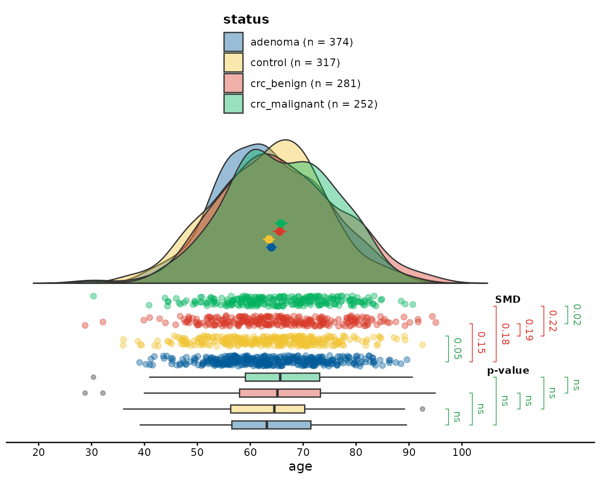
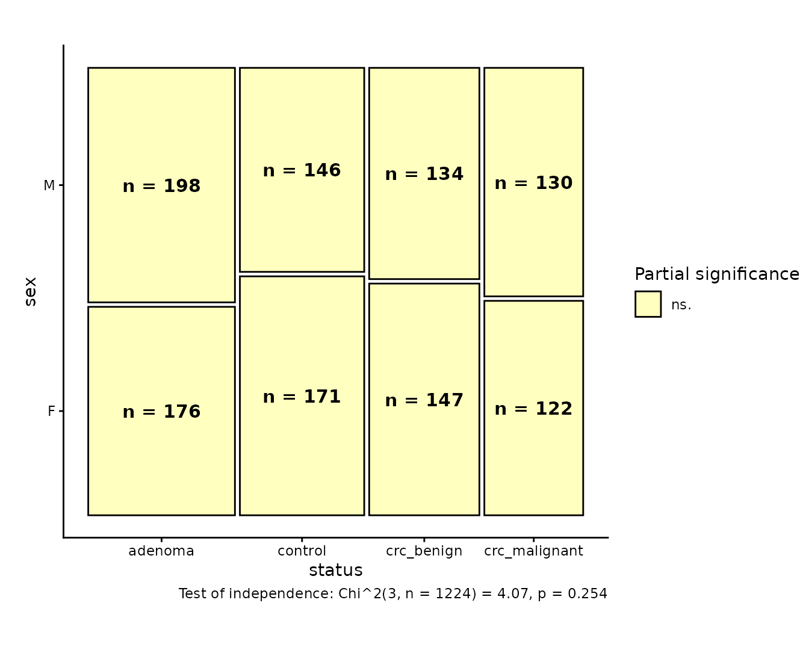
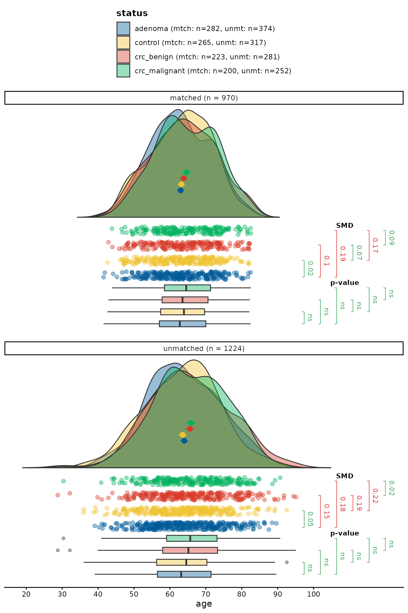
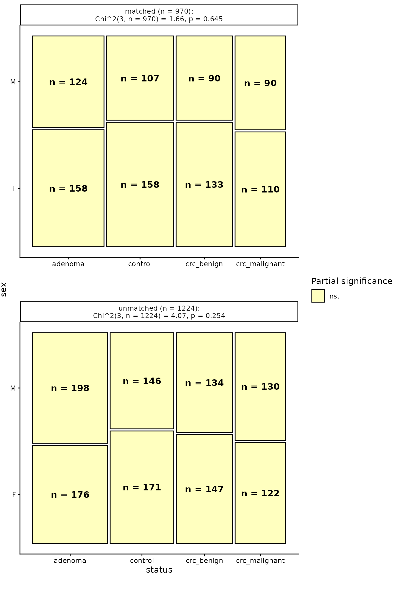

# Matching Patients in the \`cancer\` Dataset with \`vecmatch\`

## Practical Example of the Vector Matching Workflow

In this chapter, we will describe an exemplary data analysis of the
`cancer` dataset from the `vecmatch` package, matching multiple cohorts
based on selected covariates. The `vecmatch` package follows a strict
workflow based on the vector matching algorithm defined by Lopez and
Gutman ([2017](#ref-lopez2017estimation)), and it is advisable to follow
it. The whole process consists of five steps to ensure the best possible
matching quality using the vector matching algorithm.

### Step 1: Data Exploration and Initial Imbalance Assessment

The `vecmatch` package provides two graphical functions for assessing
initial dataset imbalance:
[`raincloud()`](https://polymerase3.github.io/vecmatch/reference/raincloud.md)
and
[`mosaic()`](https://polymerase3.github.io/vecmatch/reference/mosaic.md).
The
[`raincloud()`](https://polymerase3.github.io/vecmatch/reference/raincloud.md)
function is designed for continuous variables, while
[`mosaic()`](https://polymerase3.github.io/vecmatch/reference/mosaic.md)
is for categorical variables. Both functions allow grouping by up to two
categorical variables using the `group` and `facet` aesthetics and
compute various statistical summaries, including significance tests and
effect size coefficients.

In this example analysis, we focus on two predictor variables from the
`cancer` dataset: the discrete `sex` and the continuous `age`. To
evaluate differences in age across `status` groups, we can use the
[`raincloud()`](https://polymerase3.github.io/vecmatch/reference/raincloud.md)
function as follows:

``` r

library(vecmatch)
library(ggplot2)

raincloud(cancer,
  age,
  status,
  significance = "t_test",
  sig_label_color = TRUE,
  sig_label_size = 3,
  limits = c(10, 120)
) +
  scale_y_continuous(breaks = seq(10, 100, 10))
```



This plot presents the conditional distribution of `age` across
different `status` groups. The standardized mean differences (SMD) are
represented by the brackets on the right side of the jittered point
plot. The results of the Student’s t-tests are displayed alongside the
boxplots on the right, providing insights into the statistical
significance of the differences in `age` between the groups.

Similarly, we can evaluate the differences in the `sex` variable using
the
[`mosaic()`](https://polymerase3.github.io/vecmatch/reference/mosaic.md)
function. The code snippet below demonstrates this:

``` r

mosaic(cancer,
  status,
  sex,
  group_counts = TRUE,
  significance = TRUE
)
```



The plot shows the conditional distribution of `sex` across different
`status` groups. The counts for all groups are displayed inside the
corresponding boxes, representing each subgroup within the mosaic plot.
Partial significance is visually coded through color filling aesthetics.
The labels provide the results of the Chi-squared test of independence,
summarizing the statistical assessment of the relationship between the
`sex` and `status` variables.

Based on the plots, we can observe some imbalance in the `age` and `sex`
variables. However, in both cases, the differences between the `status`
groups appear to be rather moderate. All Student’s t-tests, adjusted for
multiple comparisons, resulted in statistically insignificant
differences in mean age values between the groups. Additionally, 2 out
of the 6 calculated standardized mean differences (SMDs) fell below the
0.10 threshold, indicating relatively small differences.

After a closer examination of the mean age values, we can notice that
they form two separate clusters. The first cluster includes controls and
patients with adenomas, who tend to be younger, while the second cluster
consists of patients with benign and malignant colorectal cancer, who
are generally older. The primary objective of the matching process will
then be to align these two clusters, ensuring they have a common mean
age value.

There were no significant differences in the `sex` distributions across
the `status` groups, as the overall Chi-square test of independence was
insignificant. All partial significance tests were statistically
insignificant, indicating small values of standardized Pearson’s
residuals.

Given the relatively small differences between the `status` groups, the
vector matching algorithm is expected to produce satisfactory results.

### Step 2: Estimation of Generalized Propensity Scores

The next step in the vector matching algorithm is the calculation of
generalized propensity scores (GPS) for the treatment variable. These
scores represent the treatment assignment probabilities and are based on
user-defined covariates. The relationship between the treatment variable
and predictors can be easily defined using `R`-specific formula
notation, allowing for both additive and interaction effects.

The `vecmatch` package provides a straightforward method for calculating
the GPS-matrix with different methods using the
[`estimate_gps()`](https://polymerase3.github.io/vecmatch/reference/estimate_gps.md)
function. However, custom approaches can also be applied within the
vector-matching workflow. The GPS-matrix used in subsequent analyses
must have the exact same structure as the output of `estimate_gps`,
containing the treatment variable and the treatment assignment
probabilities for each level of the treatment variable. Importantly, the
probabilities for each row in the GPS-matrix must sum to 1. The
resulting `data.frame` has to be of class `gps`.

In the following example, we will use a simple formula with `age` and
`sex` as predictors, allowing for an interaction effect. The method used
to estimate the generalized propensity scores (GPS) will be a
multinomial logistic regression, which can handle multiple levels of the
treatment variable. The code for estimating the GPS using the
multinomial logistic regression model is as follows:

``` r

formula_cancer <- status ~ age * sex
gps_matrix <- estimate_gps(formula_cancer,
  cancer,
  method = "multinom",
  reference = "control"
)
head(gps_matrix, 7)
#> gps object (generalized propensity scores)
#> • Number of units: 7
#> • Number of treatments: 4
#> • Treatment column: treatment
#> • GPS probability columns: control, adenoma, crc_benign, crc_malignant
#> • Treatment levels: control, adenoma, crc_benign, crc_malignant
#> • All columns except 'treatment' store probabilities in [0, 1].
#> 
#>   treatment   control   adenoma crc_benign crc_malignant
#> 1   control 0.3050838 0.3254835  0.2074179     0.1620149
#> 2   control 0.2367189 0.3264350  0.2217444     0.2151016
#> 3   control 0.2242229 0.3238480  0.2290992     0.2228299
#> 4   control 0.2796174 0.2875377  0.2373547     0.1954901
#> 5   control 0.3200282 0.3335474  0.1772439     0.1691805
#> 6   control 0.3310855 0.3689677  0.1730250     0.1269219
#> 7   control 0.2647639 0.2668865  0.2534869     0.2148627
```

### Step 3: Calculating Common Support Region Borders

To remove observations that are not eligible for further matching, the
borders of the common support region (CSR) must be calculated. The
[`csregion()`](https://polymerase3.github.io/vecmatch/reference/csregion.md)
function facilitates this process by taking the `gps_matrix` object as
its sole argument. It computes the CSR borders and automatically filters
the input `gps_matrix` to include only the observations that fall within
the calculated CSR borders.

The function returns an object of class `csr_matrix`, which contains the
filtered data along with several additional attributes. These attributes
enable users to manually filter the initial `gps_matrix` or access a
summary of the CSR border calculation as a `data.frame` object. The
[`csregion()`](https://polymerase3.github.io/vecmatch/reference/csregion.md)
function can be used as follows:

``` r

csr_matrix <- csregion(gps_matrix)
```

We can then compare the dimensions of the original `gps_matrix` and the
filtered `csr_matrix`.

``` r

dim(gps_matrix)
#> [1] 1224    5
dim(csr_matrix)
#> [1] 1204    5
```

Clearly, 24 observations have been filtered out of the original matrix.

Next, as recommended by Lopez and Gutman
([2017](#ref-lopez2017estimation)), the GPS can be recalculated using
only the data within the CSR. However, in our experience, this
additional step does not result in a significant improvement in matching
quality, especially if the number of observations that fall outside of
the CSR is relatively small in comparison to the whole dataset size.
Therefore, we decided to bypass this step and proceed with matching
directly on the filtered dataset.

### Step 4: k-Means Clustering and Matching

The most crucial step of the vector matching algorithm is the *k*-means
clustering and subsequent matching within the resulting clusters. This
approach ensures that only observations with similar GPS vectors are
matched, thereby justifying the name *vector matching*. The core
components of this step are the
[`stats::kmeans()`](https://rdrr.io/r/stats/kmeans.html) function (
[Core Team 2024](#ref-rlang2024)), which performs clustering, and the
[`Matching::Matchby()`](https://rdrr.io/pkg/Matching/man/Matchby.html)
or
[`optmatch::fullmatch()`](https://rdrr.io/pkg/optmatch/man/fullmatch.html)
functions Hansen and Klopfer ([2006](#ref-hansen2006optimal)), which
match observations within each *k*-means cluster. These functionalities
are combined into a single function named
[`match_gps()`](https://polymerase3.github.io/vecmatch/reference/match_gps.md).

The
[`match_gps()`](https://polymerase3.github.io/vecmatch/reference/match_gps.md)
function takes the `csr_matrix` as input and returns a matched dataset.
The matching process can be customized using various arguments, and it
is advisable to experiment with different parameter combinations to
optimize both matching quality and the number of matched samples (see
appendix ). For the replicability of results, it is also crucial to set
the random number generator seed before running the clustering and
matching procedures. This ensures that the clustering assignments and
matches are consistent across different runs of the analysis, allowing
others to reproduce the results exactly.

The
[`match_gps()`](https://polymerase3.github.io/vecmatch/reference/match_gps.md)
function can be used as follows:

``` r

set.seed(164373)
matched_cancer <- match_gps(csr_matrix,
  caliper = 0.21,
  kmeans_cluster = 2,
  reference = "control",
  method = "fullopt",
  order = "desc"
)
```

### Step 5: Post-Matching Quality Assessment

The `vecmatch` package provides a dedicated function,
[`balqual()`](https://polymerase3.github.io/vecmatch/reference/balqual.md),
to assess the quality of post-matching results. This function compares
various metrics and statistical summaries between the pre- and
post-matching datasets, using a user-defined formula to evaluate
balance. Its usage is straightforward and requires only the matched
dataset (produced by
[`match_gps()`](https://polymerase3.github.io/vecmatch/reference/match_gps.md))
and the formula used for the calculation of the GPS:

``` r

balqual(matched_cancer,
  formula_cancer,
  type = "smd",
  statistic = "max",
  round = 4
)
#> 
#> Matching Quality Evaluation
#> ================================================================================ 
#> 
#> Count table for the treatment variable:
#> -------------------------------------------------- 
#> Treatment                 | Before     | After      
#> -------------------------------------------------- 
#> adenoma                   | 373        | 282        
#> control                   | 313        | 265        
#> crc_benign                | 271        | 223        
#> crc_malignant             | 247        | 200        
#> -------------------------------------------------- 
#> 
#> 
#> Matching summary statistics:
#> ---------------------------------------- 
#> Total n before matching:  1204 
#> Total n after matching:       970 
#> % of matched observations:    80.56 %
#> Total  maximal   SMD value:   0.1887 
#> 
#> 
#> Maximal values :
#> -------------------------------------------------------------------------------- 
#> Variable                  | Coef  | Before       | After        | Quality      
#> -------------------------------------------------------------------------------- 
#> age                       | SMD   | 0.2150       | 0.1887       | Not Balanced 
#> sexF                      | SMD   | 0.1480       | 0.0931       | Balanced     
#> sexM                      | SMD   | 0.1480       | 0.0931       | Balanced     
#> age:sexF                  | SMD   | 0.1548       | 0.0898       | Balanced     
#> age:sexM                  | SMD   | 0.1591       | 0.1037       | Not Balanced 
#> --------------------------------------------------------------------------------
```

The metrics above summarize *pairwise* comparisons between the treatment
levels. To additionally compare the marginal distributions of the
covariates between the unmatched and the matched dataset, add
`desc_full` to the `type` argument. Numeric covariates are summarized by
`N`, the mean, standard deviation, minimum, quartiles, median, maximum,
skewness and excess kurtosis, while categorical covariates are
cross-tabulated by the count and percentage of each level. Both are
reported within every treatment level and are printed as two separate
tables which, like the balance tables above, carry the statistics in the
rows and the two matching stages in the `Before` and `After` columns:

``` r

balqual(matched_cancer,
  formula_cancer,
  type = c("smd", "desc_full"),
  statistic = "max",
  round = 4
)
#> 
#> Matching Quality Evaluation
#> ================================================================================ 
#> 
#> Count table for the treatment variable:
#> -------------------------------------------------- 
#> Treatment                 | Before     | After      
#> -------------------------------------------------- 
#> adenoma                   | 373        | 282        
#> control                   | 313        | 265        
#> crc_benign                | 271        | 223        
#> crc_malignant             | 247        | 200        
#> -------------------------------------------------- 
#> 
#> 
#> Matching summary statistics:
#> ---------------------------------------- 
#> Total n before matching:  1204 
#> Total n after matching:       970 
#> % of matched observations:    80.56 %
#> Total  maximal   SMD value:   0.1887 
#> 
#> 
#> Maximal values :
#> -------------------------------------------------------------------------------- 
#> Variable                  | Coef  | Before       | After        | Quality      
#> -------------------------------------------------------------------------------- 
#> age                       | SMD   | 0.2150       | 0.1887       | Not Balanced 
#> sexF                      | SMD   | 0.1480       | 0.0931       | Balanced     
#> sexM                      | SMD   | 0.1480       | 0.0931       | Balanced     
#> age:sexF                  | SMD   | 0.1548       | 0.0898       | Balanced     
#> age:sexM                  | SMD   | 0.1591       | 0.1037       | Not Balanced 
#> -------------------------------------------------------------------------------- 
#> 
#> Descriptive statistics of the continuous covariates:
#> -------------------------------------------------------- 
#> Variable | Group         | Statistic |  Before |   After 
#> -------------------------------------------------------- 
#> age      | adenoma       | N         |     373 |     282 
#> age      | adenoma       | Mean      | 63.9359 | 62.9839 
#> age      | adenoma       | SD        | 10.0129 |   8.368 
#> age      | adenoma       | Min       | 39.0788 | 41.5359 
#> age      | adenoma       | Q1        |  56.491 | 57.0566 
#> age      | adenoma       | Median    | 63.0986 | 62.7616 
#> age      | adenoma       | Q3        | 71.3762 | 70.0099 
#> age      | adenoma       | Max       | 89.6203 | 82.4682 
#> age      | adenoma       | Skewness  |  0.1038 |  0.0111 
#> age      | adenoma       | Kurtosis  | -0.4251 | -0.5377 
#> age      | control       | N         |     313 |     265 
#> age      | control       | Mean      | 63.7051 |  63.185 
#> age      | control       | SD        |  9.8932 |  8.3318 
#> age      | control       | Min       |    39.2 |  42.594 
#> age      | control       | Q1        | 56.6697 | 57.4042 
#> age      | control       | Median    | 64.5738 | 63.9048 
#> age      | control       | Q3        | 70.2905 | 69.6532 
#> age      | control       | Max       | 89.2571 | 82.1037 
#> age      | control       | Skewness  | -0.0101 | -0.1712 
#> age      | control       | Kurtosis  | -0.3284 | -0.6026 
#> age      | crc_benign    | N         |     271 |     223 
#> age      | crc_benign    | Mean      | 65.2431 | 63.8124 
#> age      | crc_benign    | SD        | 10.0518 |  8.9352 
#> age      | crc_benign    | Min       | 39.8699 | 42.8761 
#> age      | crc_benign    | Q1        | 58.0628 | 57.8345 
#> age      | crc_benign    | Median    | 64.8065 | 63.5093 
#> age      | crc_benign    | Q3        | 73.0519 | 70.6025 
#> age      | crc_benign    | Max       | 87.5219 |   82.22 
#> age      | crc_benign    | Skewness  |  0.0774 | -0.0091 
#> age      | crc_benign    | Kurtosis  | -0.6851 | -0.6223 
#> age      | crc_malignant | N         |     247 |     200 
#> age      | crc_malignant | Mean      | 65.7584 | 64.5901 
#> age      | crc_malignant | SD        |  9.5506 |  8.5123 
#> age      | crc_malignant | Min       | 43.8724 | 43.8724 
#> age      | crc_malignant | Q1        |   59.15 |  58.479 
#> age      | crc_malignant | Median    | 65.6405 | 64.5361 
#> age      | crc_malignant | Q3        | 73.0273 |  71.311 
#> age      | crc_malignant | Max       | 84.8777 |  82.569 
#> age      | crc_malignant | Skewness  | -0.0752 | -0.0256 
#> age      | crc_malignant | Kurtosis  | -0.7084 | -0.6706 
#> -------------------------------------------------------- 
#> 
#> Distribution of the categorical covariates:
#> ------------------------------------------------------------ 
#> Variable | Group         | Level | Before      | After       
#> ------------------------------------------------------------ 
#> sex      | adenoma       | F     | 175 (46.9%) | 158 (56.0%) 
#> sex      | adenoma       | M     | 198 (53.1%) | 124 (44.0%) 
#> sex      | control       | F     | 170 (54.3%) | 158 (59.6%) 
#> sex      | control       | M     | 143 (45.7%) | 107 (40.4%) 
#> sex      | crc_benign    | F     | 142 (52.4%) | 133 (59.6%) 
#> sex      | crc_benign    | M     | 129 (47.6%) |  90 (40.4%) 
#> sex      | crc_malignant | F     | 119 (48.2%) | 110 (55.0%) 
#> sex      | crc_malignant | M     | 128 (51.8%) |  90 (45.0%) 
#> ------------------------------------------------------------
```

If the full table is longer than comfortable, `desc_reduced` restricts
the summary of the numeric covariates to `N`, the minimum, mean, median
and maximum. The cross-tabulation of the categorical covariates is
unaffected:

``` r

balqual(matched_cancer,
  formula_cancer,
  type = c("smd", "desc_reduced"),
  statistic = "max",
  round = 4
)
#> 
#> Matching Quality Evaluation
#> ================================================================================ 
#> 
#> Count table for the treatment variable:
#> -------------------------------------------------- 
#> Treatment                 | Before     | After      
#> -------------------------------------------------- 
#> adenoma                   | 373        | 282        
#> control                   | 313        | 265        
#> crc_benign                | 271        | 223        
#> crc_malignant             | 247        | 200        
#> -------------------------------------------------- 
#> 
#> 
#> Matching summary statistics:
#> ---------------------------------------- 
#> Total n before matching:  1204 
#> Total n after matching:       970 
#> % of matched observations:    80.56 %
#> Total  maximal   SMD value:   0.1887 
#> 
#> 
#> Maximal values :
#> -------------------------------------------------------------------------------- 
#> Variable                  | Coef  | Before       | After        | Quality      
#> -------------------------------------------------------------------------------- 
#> age                       | SMD   | 0.2150       | 0.1887       | Not Balanced 
#> sexF                      | SMD   | 0.1480       | 0.0931       | Balanced     
#> sexM                      | SMD   | 0.1480       | 0.0931       | Balanced     
#> age:sexF                  | SMD   | 0.1548       | 0.0898       | Balanced     
#> age:sexM                  | SMD   | 0.1591       | 0.1037       | Not Balanced 
#> -------------------------------------------------------------------------------- 
#> 
#> Descriptive statistics of the continuous covariates:
#> -------------------------------------------------------- 
#> Variable | Group         | Statistic |  Before |   After 
#> -------------------------------------------------------- 
#> age      | adenoma       | N         |     373 |     282 
#> age      | adenoma       | Min       | 39.0788 | 41.5359 
#> age      | adenoma       | Mean      | 63.9359 | 62.9839 
#> age      | adenoma       | Median    | 63.0986 | 62.7616 
#> age      | adenoma       | Max       | 89.6203 | 82.4682 
#> age      | control       | N         |     313 |     265 
#> age      | control       | Min       |    39.2 |  42.594 
#> age      | control       | Mean      | 63.7051 |  63.185 
#> age      | control       | Median    | 64.5738 | 63.9048 
#> age      | control       | Max       | 89.2571 | 82.1037 
#> age      | crc_benign    | N         |     271 |     223 
#> age      | crc_benign    | Min       | 39.8699 | 42.8761 
#> age      | crc_benign    | Mean      | 65.2431 | 63.8124 
#> age      | crc_benign    | Median    | 64.8065 | 63.5093 
#> age      | crc_benign    | Max       | 87.5219 |   82.22 
#> age      | crc_malignant | N         |     247 |     200 
#> age      | crc_malignant | Min       | 43.8724 | 43.8724 
#> age      | crc_malignant | Mean      | 65.7584 | 64.5901 
#> age      | crc_malignant | Median    | 65.6405 | 64.5361 
#> age      | crc_malignant | Max       | 84.8777 |  82.569 
#> -------------------------------------------------------- 
#> 
#> Distribution of the categorical covariates:
#> ------------------------------------------------------------ 
#> Variable | Group         | Level | Before      | After       
#> ------------------------------------------------------------ 
#> sex      | adenoma       | F     | 175 (46.9%) | 158 (56.0%) 
#> sex      | adenoma       | M     | 198 (53.1%) | 124 (44.0%) 
#> sex      | control       | F     | 170 (54.3%) | 158 (59.6%) 
#> sex      | control       | M     | 143 (45.7%) | 107 (40.4%) 
#> sex      | crc_benign    | F     | 142 (52.4%) | 133 (59.6%) 
#> sex      | crc_benign    | M     | 129 (47.6%) |  90 (40.4%) 
#> sex      | crc_malignant | F     | 119 (48.2%) | 110 (55.0%) 
#> sex      | crc_malignant | M     | 128 (51.8%) |  90 (45.0%) 
#> ------------------------------------------------------------
```

Note that the descriptive tables describe the covariates as they appear
in the `formula`, whereas the balance metrics are computed on the model
matrix. `sex` is therefore described once by its levels rather than once
per dummy-coded column, and the `age:sex` interaction is covered by the
balance metrics only, as it is a model term rather than a covariate.

After assessing the quality with
[`balqual()`](https://polymerase3.github.io/vecmatch/reference/balqual.md),
we can combine both matched and unmatched datasets into a single data
frame to visualize age and sex using
[`raincloud()`](https://polymerase3.github.io/vecmatch/reference/raincloud.md)
and
[`mosaic()`](https://polymerase3.github.io/vecmatch/reference/mosaic.md):

``` r

matched_cancer$dataset <- "matched"
unmatched_cancer <- cancer
unmatched_cancer$dataset <- "unmatched"
data_full <- rbind(matched_cancer, unmatched_cancer)
```

``` r

raincloud(data_full,
  age,
  status,
  dataset,
  significance = "t_test",
  sig_label_color = TRUE,
  sig_label_size = 3,
  limits = c(10, 120)
) +
  scale_y_continuous(breaks = seq(10, 100, 10))
```



``` r

mosaic(data_full,
  status,
  sex,
  dataset,
  group_counts = TRUE,
  significance = TRUE
)
```



### References

Core Team. 2024. *: A Language and Environment for Statistical
Computing*. Foundation for Statistical Computing.
<https://www.R-project.org/>.

Hansen, Ben B, and Stephanie Olsen Klopfer. 2006. “Optimal Full Matching
and Related Designs via Network Flows.” *Journal of Computational and
Graphical Statistics* 15 (3): 609–27.

Lopez, Michael J, and Roee Gutman. 2017. “Estimation of Causal Effects
with Multiple Treatments: A Review and New Ideas.” *Statistical
Science*, 432–54.

Sekhon, Jasjeet S. 2011. “Multivariate and Propensity Score Matching
Software with Automated Balance Optimization: The Package for .”
*Journal of Statistical Software* 42: 1–52.
